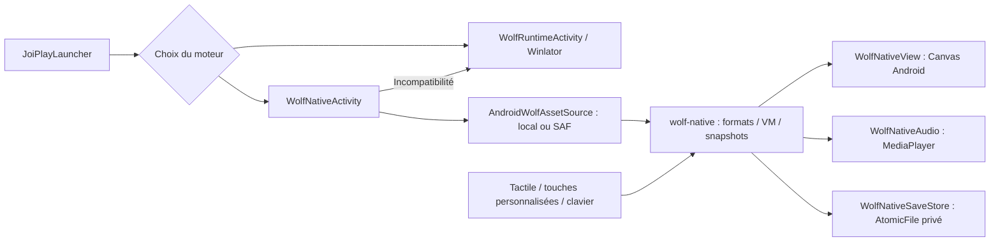

# Moteur Wolf Android intégré

Implémentation du 10 octobre 2026, Astra 1.12.0-beta.14 (42). Le moteur est expérimental : les fichiers des deux exemples officiels se lisent correctement, mais leur partie rencontre encore des commandes non portées. Winlator reste disponible. Ce document décrit le code livré ; les preuves d'exécution sont consignées dans [la validation de la bêta 14](../VALIDATION_1.12.0-beta.14.md).

## Choisir le moteur

**Outils → Réglages Wolf RPG → Moteur** propose trois choix par jeu :

- **Automatique** : garde Winlator si le jeu possède déjà un préfixe ou un état Windows, pour préserver sa progression. Pour un nouveau jeu, lit les métadonnées puis vérifie les fonctions avant d'utiliser le natif ; une incompatibilité déclenche le secours Winlator et un diagnostic conservé.
- **Natif expérimental** : tente directement l'interpréteur Android. Une fonction inconnue arrête la session avec fichier, événement, commande et offset, et propose **Lancer avec Winlator**.
- **Winlator / Windows** : utilise directement le parcours existant. Les profils de lancement externes explicitement sélectionnés restent externes.

Une admission automatique positive exige toutes les cartes et les commandes connues ; un refus définitif peut arrêter la vérification plus tôt. Elle ne certifie pas toute la sémantique de Wolf. Voir [RUNTIME_COVERAGE.md](RUNTIME_COVERAGE.md) pour la liste exacte des variantes encore refusées.

## Architecture effectivement livrée

`wolf-native` est un module Kotlin/JVM sans dépendance Android, intégré au DEX de l'application. Les commandes sont exécutées par un seul worker de session. Le tick logique suit la cadence 30/60 du jeu, indépendamment de la limite d'affichage. Les frames transmis au thread principal sont regroupés ; les entrées et opérations de sauvegarde passent par le même propriétaire de VM.

Les lecteurs couvrent Game.dat, CommonEvent.dat, bases de données, tilesets et cartes CP932/UTF-8, dont les blocs LZ4 observés. Les lectures et allocations comptabilisées sont bornées, avec diagnostics de troncature, valeurs invalides et budgets dépassés. Ces budgets ne constituent pas une mesure exacte du pic de mémoire JVM.

Le rendu utilise les display lists Canvas accélérées par Android, décodages asynchrones, cache de bitmaps de 96 Mio et cache de morceaux de carte de 32 Mio. Les ressources visibles sont conservées. Le rendu comprend les couches de carte, les autotiles, personnages, pics, dialogues et choix pris en charge. La peau personnalisée des fenêtres Wolf et certaines variantes avancées restent absentes ; aucune équivalence graphique complète n'est annoncée.

Le lecteur audio utilise réellement MediaPlayer pour les formats Android, sur un thread dédié, avec journalisation des étapes de préparation et démarrage. Ce backend ne reproduit pas le synthétiseur GuruGuruSMF Windows ni toutes ses règles musicales.

## Accès aux ressources et cycle de vie

Le moteur consulte le dossier sélectionné, y compris une URI de sous-dossier dans un arbre SAF parent. Il indexe seulement les répertoires qu'il visite et charge les cartes/bitmaps demandés. Il n'importe pas tout le jeu. Les quelques pistes qui nécessitent un fichier local pour MediaPlayer sont mises en cache à la demande.

Les chemins sont confinés au jeu ; les recherches insensibles à la casse refusent les ambiguïtés. Les appels SAF sont annulables et la fermeture invalide les lectures. Les archives Wolf protégées ne sont pas décodées par cette version : elles provoquent un refus ou un secours Windows.

Les commandes restent masquées pendant les huit étapes et n'apparaissent qu'après une première image dont les ressources sont décodées. Une attente de plus de 180 secondes produit un diagnostic. Une relance crée une session neuve ; Android ne restaure pas implicitement une VM interrompue. Pause, perte de focus, menu et verrouillage Astra relâchent les entrées et suspendent la session.

## Contrôles et affichage

Les touches Astra conservent taille, opacité, position par orientation et actions remappées. Deux doigts envoient la touche Retour configurée ; le pincement optionnel zoome de 1× à 4× et permet de déplacer l'image. Les modes Image entière / Remplir / Étirer utilisent les mêmes réglages. La taille logique du jeu est conservée : le mode Remplir rogne, le mode Étirer déforme ; aucun décor supplémentaire n'est inventé.

Les coordonnées tactiles sont converties vers le viewport logique. Le clic utilise le comportement porté par la VM ; le déplacement au toucher reste soumis aux collisions et déclencheurs pris en charge. L'option Direction au toucher fournit les directions maintenues. Les sources clavier, écran et boutons sont agrégées pour qu'un relâchement ne libère pas une touche encore tenue ailleurs.

## Sauvegardes natives

Les fichiers se trouvent dans `files/wolf-native/<SHA-256 de l'identifiant du jeu>/saves/slot-N.astrawolf`. Ils contiennent une enveloppe `ASTRA-WOLF-NATIVE-1` et un snapshot `AWNS` V2, empreinte des métadonnées et somme SHA-256. Chaque remplacement est atomique et conserve une copie `.previous`. Le chargement vérifie les bornes, CRC, chemins et empreintes avant de modifier l'état.

**Ces fichiers ne sont pas compatibles avec les sauvegardes Windows.** Aucune conversion ni modification du Save/SaveData original n'a lieu. Le menu de partie propose sauvegarde, chargement et export natifs ; **Outils → Sauvegardes Wolf RPG** les affiche séparément et propose leur ZIP.

Le snapshot conserve les variables/DB, RNG, héros, événements, pics et contrôles. Il ne restaure pas la pile d'événements ni le dialogue en cours. Une route, un tween ou un son continu non sérialisé empêchent explicitement une sauvegarde plutôt que de perdre cet état silencieusement. Le chargement Windows et ses formats restent à implémenter et comparer.
