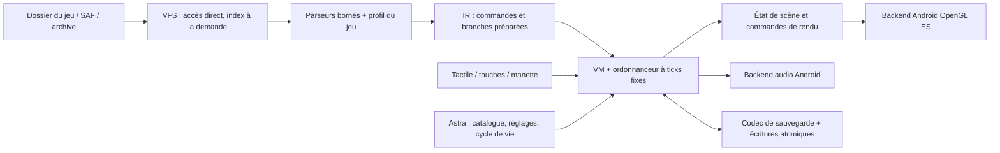

# Construction du moteur Wolf Android d’Astra

Plan initial du 10 octobre 2026, fondé sur [l’analyse REA](REA_ANALYSIS.md) et [les formats examinés](FORMATS_RESEARCH.md). Ce document conserve la proposition de reconstruction et ses critères. L'[implémentation livrée](IMPLEMENTATION.md) utilise finalement un cœur Kotlin portable et un renderer Android Canvas : les paragraphes C++/JNI/OpenGL ci-dessous décrivent le plan initial, pas l'architecture actuelle. Les critères de compatibilité des deux échantillons et de sauvegardes Windows ne sont pas encore remplis ; voir la [couverture mesurée](RUNTIME_COVERAGE.md).

La cible est un interpréteur des données Wolf, compilé pour Android ARM64 et x86_64, qui utilise directement les ressources du jeu. `Game.exe` sert de référence de comportement pendant la recherche; le moteur natif n’en exécute pas le code x86.

## Architecture retenue

Un cœur C++ indépendant d’Android contient les formats, l’état du jeu, les commandes et l’ordonnanceur. L’adaptateur Android fournit fichiers, surface graphique, horloge, entrées et audio. Kotlin conserve le catalogue, les permissions, les réglages et le cycle de vie. Les échanges JNI portent sur des lots d’entrées et des opérations de session, pas sur chaque sprite ou variable.

Découpage proposé : `wolf-core/{formats,ir,vm,world,resources,save}`, `wolf-android/{jni,storage,render,audio,input}`, fixtures indépendantes et tests différentiels. Ces modules n’existent pas encore dans Gradle. Ne pas appeler `windows-runtime` depuis le cœur natif : son X11 et son environnement Windows appartiennent au lancement Wine actuel.

### Formats et IR

Porter les formats validés vers un lecteur C++ strict, puis ajouter `Game.dat`, DB et tilesets. Chaque lecture doit vérifier taille, multiplication, encodage, compteurs et consommation du payload. Les quotas doivent produire une erreur de capacité explicite, jamais une lecture partielle présentée comme réussite. Les marqueurs observés ne définissent pas à eux seuls toutes les versions compatibles.

L’IR conserve pour chaque commande : fichier et offset, ID d’événement/page, opcode original, arguments signés, profondeur de branche, chaînes, route et extension. Conserver séparément l’opération préparée et les destinations de branche. La passe de préparation peut résoudre labels, common events et colonnes DB; elle ne doit pas réécrire les fichiers d’origine ni effacer les informations nécessaires au diagnostic.

Un `GameProfile` appartient à une session et indique dialectes de fichiers, encodage, taille logique, cadence logique et options de compatibilité du jeu. Les globals de version des outils de traduction ne peuvent pas être partagés entre deux jeux. Les 48 types du corpus servent de priorité; le moteur doit inventorier aussi les commandes et variantes absentes de ce corpus.

### Variables et VM

Ne pas remplacer les identifiants Wolf par un unique dictionnaire d’entiers. Il faut des espaces de variables globaux, système, carte, Self et Common, ainsi que les chaînes, DB mutables et références indirectes. Les plages d’identifiants et les opérations doivent être établies avec les lecteurs et handlers REA, puis vérifiées sur fixtures. Le stockage C++ doit définir explicitement débordement, division, modulo et aléatoire; les règles du langage C++ ne constituent pas la spécification du moteur Windows.

Un contexte d’événement contient programme, position, branche, contexte local, appels et raison de suspension. Les résultats d’une instruction sont explicites : continuer, sauter, appeler, attendre des ticks, attendre une entrée/mouvement, terminer, ou erreur. L’ordonnanceur gère les pages actives, événements automatiques/parallèles et appels réservés dans un ordre déterministe. La documentation officielle et REA établissent la nécessité de ces états; leur ordre exact reste à tester.

Le handler `Wait` observé prépare un compteur d’attente puis rend la main. Le backend Android ne doit donc pas dormir sur le thread principal pour réaliser cette commande. Un budget d’instructions protège l’application contre une boucle infinie, avec diagnostic de l’événement et de l’offset concernés. Ce budget ne doit pas changer silencieusement l’état du jeu.

### Carte, images et texte

Le moteur doit décoder layers, tilesets/autotiles, priorité, passage directionnel, collisions, événements, routes et caméra. Afficher une matrice de tiles ne suffit pas à prouver un RPG jouable. Les dialogues demandent aussi les codes de contrôle, substitution de variables, attente/accélération, choix, fonts et glyphes japonais.

Choix initial : backend OpenGL ES avec une surface native, batching des sprites, cache de glyphes et textures résidentes. Le cœur ne dépend pas de ce choix. DxLib Android reste un backend de comparaison possible : ses sources et notices sont disponibles, mais ses propres archives et comportements modifiés par Wolf doivent être étudiés. Aucun build de DxLib Android n’est livré par cette recherche.

Ne pas déformer les images en changeant la résolution logique d’un jeu 4:3. La caméra et la mise en page suivent les données du jeu. Conserver les modes Astra «image entière», «remplir en rognant» et «étirer», et le zoom, dans la transformation du viewport. Un vrai élargissement du monde en 16:9 nécessite une vérification des cartes, scripts et UI du jeu.

### Fichiers et démarrage

Réutiliser le dossier autorisé par Astra. Le VFS traduit les chemins logiques Wolf vers un accès local ou SAF, conserve l’écriture exacte des noms et signale les collisions de recherche. La normalisation des séparateurs doit rester confinée au dossier autorisé. L’ordre entre fichiers libres et archives devra être mesuré sur le moteur original.

Pour SAF, obtenir des descripteurs et distinguer les fournisseurs qui permettent réellement la lecture aléatoire de ceux qui livrent des flux. Mettre en cache à la demande seulement les ressources qui l’exigent. Indexer les répertoires consultés et précharger les métadonnées, la première carte et ses ressources; ne pas parcourir ni recopier les 70 000 fichiers avant la première image. Une archive doit pouvoir être indexée une fois et lue par entrée, sans extraction générale.

La durée mesurée sur PC pour le parseur Python est une mesure de structure de données, pas une preuve de temps de démarrage Android. Le futur écran de préparation affiche les étapes réellement terminées : accès source, profil, données, carte initiale, ressources et première image. Les commandes tactiles apparaissent seulement après un frame de jeu valide.

### Fluidité

Séparer tick logique 30/60 du rafraîchissement de la surface. Une attente de 60 ticks ou un déplacement ne doit pas changer de durée quand l’écran passe de 60 à 120 Hz. Les compatibilités liées aux ticks restent testées par profil.

Les ralentissements liés aux images se travaillent dans le pipeline de ressources : décodage et lectures sur workers, préchargement des ressources de la carte et des premières branches probables, cache LRU avec budget mémoire, uploads GPU fractionnés, suppression des décodages répétés et mesures du temps de chaque phase. Ne pas évincer systématiquement des textures encore visibles. Préparer les chaînes substituées et glyphes hors des étapes coûteuses du rendu lorsque leur contenu le permet.

Les cibles sont des budgets mesurés : 33,3 ms par frame pour 30 FPS et 16,7 ms pour 60 FPS. Collecter médiane, p95/p99, frames longues, temps de tick, lecture, décodage, upload et mémoire. Un framerate affiché seul ne permet pas d’attribuer les chutes. Une cadence constante sur tous les jeux et téléphones ne peut pas être promise avant ces mesures.

### Entrées et cycle de vie

Faire correspondre les entrées au viewport logique, après zoom et recadrage. Réutiliser le modèle des commandes Astra personnalisables : disposition, opacité, touche Retour par deux doigts et zoom activable. Le moteur reçoit des états cohérents de press/release; relâcher les touches lors d’une interruption ou perte de focus. Le déplacement au toucher doit respecter la capacité réelle du jeu; ne pas inventer un pathfinding qui contourne les scripts ou collisions.

Créer une session neuve au lancement, fermer les ressources au retour et journaliser les erreurs avant destruction. Une sortie forcée ne doit pas laisser un état global partagé qui bloque le prochain jeu. La reprise Android doit proposer le rapport ou une relance propre et ne pas restaurer automatiquement une session corrompue.

### Audio et sauvegardes

Prévoir un adaptateur audio pour les formats du corpus, boucles, fade, volume et MIDI. La présence de `GuruGuruSMF4.dll` dans les EXE établit une dépendance Windows; elle ne fournit pas un synthétiseur Android compatible. Choisir et valider le backend sur des pistes et transitions témoins.

Conserver les sauvegardes d’origine tant que leur codec n’est pas validé. Écrire les sorties du prototype dans un espace distinct, avec fichier temporaire, synchronisation, renommage et backup. Un save natif privé ne doit pas être annoncé comme compatible avec les saves Wolf Windows.

Le contrat officiel de chargement ne correspond pas à la simple restauration de toute la pile d’un événement : [le manuel décrit un chargement sans événement en cours](https://smokingwolf.github.io/tool_wolf_rpg_editor/help/04ev_file.html). Valider les sauvegardes complètes, écritures partielles, noms personnalisés et DB conservées par des allers-retours avec Windows avant d’exposer une migration.

## Jalons et preuves de passage

| Jalon | Livrable | Critère pour passer au suivant |
|---|---|---|
| M0 — formats | Sonde de recherche livrée; futurs parseurs C++ et IR | Consommation exacte des fichiers admis; mêmes résultats entre Python et C++; tests de troncature et quotas. **Aujourd’hui : Python seulement pour cartes/CommonEvent.** |
| M1 — scène native | Lecteurs Game/DB/tilesets + première carte Android | Tiles/autotiles, couches, caméra et collisions identiques aux fixtures; démarrage sans copie générale. |
| M2 — partie de démonstration | Variables, branches, loops, common events, input, texte et images | Titre → nouvelle partie → déplacement → dialogue → changement de carte dans les deux échantillons, avec trace déterministe de l’état. |
| M3 — état et effets | Audio, transitions, images complexes, save/load | Comparaisons différentielles et allers-retours de saves; interruption et relance propres. |
| M4 — corpus étendu | Profils de versions, archives, fonctions supplémentaires | Chaque jeu annoncé passe les scénarios documentés; les fonctions non couvertes donnent un diagnostic, jamais un lancement faussement compatible. |

Les tests Android utiliseront exclusivement Android Studio Emulator et les outils SDK : ADB, instrumentation et Logcat. Les tests du cœur portable restent exécutables sur l’hôte. La présence du téléphone de l’utilisateur ou d’un jeu commercial dans un ancien log n’est pas une validation du futur moteur.

Pour chaque fixture différentielle, garder hash des fichiers, version/profil original, suite d’entrées datées en ticks, variables/DB attendues, positions, suspensions et captures. Couvrir dès M2 : branche imbriquée, boucle avec sortie, Common par ID/nom et retour, attente 0/1/négative/indirecte, input appuyé/relâché, image remplacée, texte japonais, RNG contrôlé et changement de carte. Des snapshots visuels seuls ne valident pas l’état du jeu.

## Intégration dans Astra

Le chemin actuel est `AstraViewModel.launchGame` → `CompatibilityDiagnostic` → `JoiPlayLauncher` → `WolfRuntimeActivity`. Ajouter un moteur natif distinct et un résultat de capacité versionné à cet endroit **après M2**, avec choix du runtime par jeu. Les modèles de commandes et réglages peuvent être partagés; les codes X11 de `WolfTouchInput` doivent être adaptés aux entrées logiques de la VM.

L’accès direct et les sauvegardes appartiennent au jeu et à ses permissions. Ne pas déplacer les saves du chemin Wine vers le nouveau cœur sans codec et vérification. Conserver le lancement Wine disponible pendant la validation du moteur natif. L'intégration Android est distribuée à partir de la bêta 14 ; ce plan de recherche ne constitue pas sa validation.
